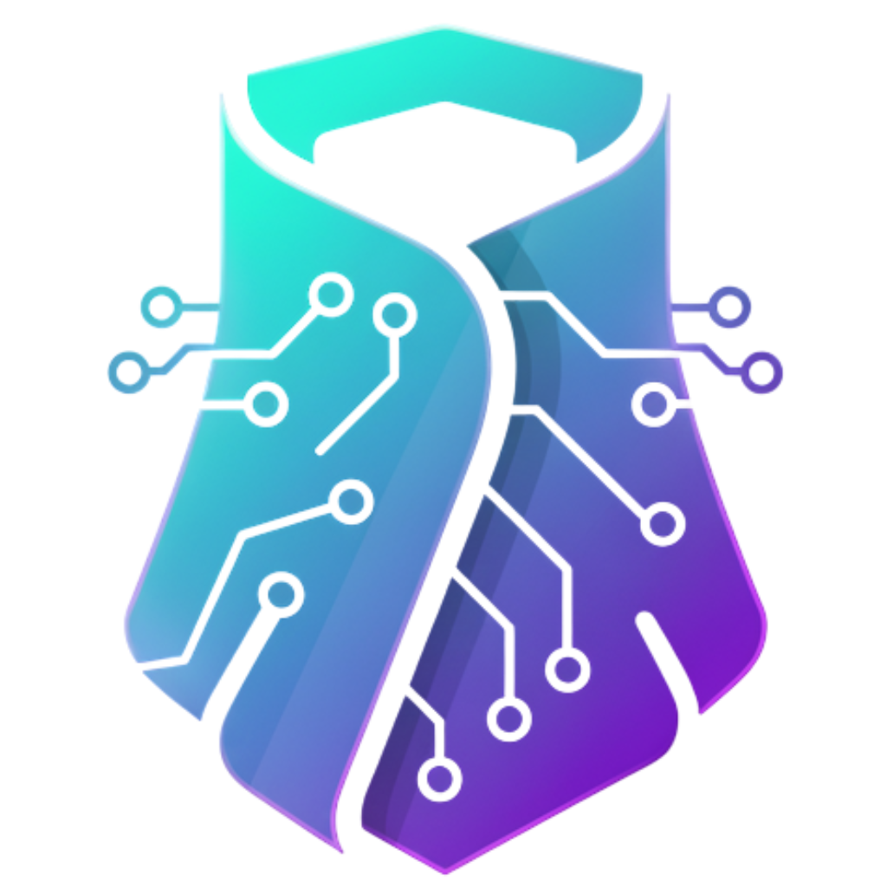

# CloakDesk Documentation

<div align="center">



**Privacy-First Blockchain Privacy Dashboard Documentation**

[](https://nextjs.org/)
[](https://www.typescriptlang.org/)
[](https://tailwindcss.com/)

[Live Documentation](https://docs.cloakdesk.xyz) • [Main App](https://www.cloakdesk.xyz/) • [GitHub](https://github.com/cloak-desk-labs/cloak-desk)

</div>

---

## 📋 Table of Contents

- [Overview](#overview)
- [Architecture](#architecture)
- [Tech Stack](#tech-stack)
- [Project Structure](#project-structure)
- [Getting Started](#getting-started)
- [Development](#development)
- [Deployment](#deployment)
- [SEO & Metadata](#seo--metadata)
- [Features](#features)
- [Contributing](#contributing)

---

## 🎯 Overview

CloakDesk Documentation is a comprehensive technical documentation site built with Next.js 14 App Router. It provides detailed guides, API references, and feature documentation for the CloakDesk privacy-first blockchain dashboard.

### Key Features

- **Static Site Generation (SSG)** - Pre-rendered pages for optimal performance
- **SEO Optimized** - Complete Open Graph and Twitter Card metadata
- **Dark Theme** - Cyberpunk-inspired design matching the main application
- **Responsive Design** - Mobile-first approach with TailwindCSS
- **Type-Safe** - Full TypeScript implementation
- **Fast Navigation** - Client-side routing with Next.js App Router

---

## 🏗️ Architecture

### Next.js App Router Structure

```
docs/
├── app/                    # Next.js App Router directory
│   ├── layout.tsx         # Root layout with metadata and navigation
│   ├── page.tsx           # Home page
│   ├── getting-started/   # Getting started guide
│   ├── features/          # Feature documentation
│   │   ├── privacy-health/
│   │   ├── stealth-routing/
│   │   ├── wallet-shadowing/
│   │   ├── mpc-vault/
│   │   ├── selective-disclosure/
│   │   ├── relayer-marketplace/
│   │   └── leaderboard/
│   └── api/               # API reference
├── public/                # Static assets
│   ├── logo.png          # CloakDesk logo
│   ├── og-banner.png     # Open Graph image (1440x810)
│   └── favicon.ico       # Site favicon
├── globals.css           # Global styles and TailwindCSS
├── tailwind.config.js     # TailwindCSS configuration
├── next.config.js        # Next.js configuration
└── tsconfig.json         # TypeScript configuration
```

### Metadata Architecture

The documentation uses Next.js 14's built-in metadata API for SEO optimization:

- **Root Layout Metadata** - Base metadata for all pages
- **Page-Specific Metadata** - Individual page overrides
- **Open Graph Tags** - Social media preview cards
- **Twitter Cards** - Twitter-specific metadata
- **Structured Data** - Semantic HTML for search engines

---

## 🛠️ Tech Stack

### Core Framework

- **[Next.js 14.2](https://nextjs.org/)** - React framework with App Router
  - Static Site Generation (SSG)
  - Server Components
  - Built-in Image Optimization
  - Automatic Code Splitting

### Language & Type Safety

- **[TypeScript 5.3](https://www.typescriptlang.org/)** - Type-safe JavaScript
  - Strict mode enabled
  - Full type coverage
  - Next.js TypeScript integration

### Styling

- **[TailwindCSS 3.4](https://tailwindcss.com/)** - Utility-first CSS framework
  - Custom color palette (cyberpunk theme)
  - Responsive design utilities
  - Dark mode support
  - Custom animations

### UI Components

- **[Lucide React](https://lucide.dev/)** - Icon library
- **[Framer Motion](https://www.framer.com/motion/)** - Animation library
- **Custom Components** - Built with TailwindCSS and TypeScript

### Build Tools

- **PostCSS** - CSS processing
- **Autoprefixer** - CSS vendor prefixing
- **ESLint** - Code linting
- **Next.js ESLint Config** - Next.js-specific linting rules

---

## 📁 Project Structure

### App Router Pages

```typescript
app/
├── layout.tsx              # Root layout with global metadata
├── page.tsx                # Documentation homepage
├── globals.css             # Global styles and TailwindCSS imports
│
├── getting-started/
│   └── page.tsx            # Getting started guide
│
├── features/
│   ├── page.tsx            # Features overview
│   ├── privacy-health/
│   │   └── page.tsx        # Privacy Health feature docs
│   ├── stealth-routing/
│   │   └── page.tsx        # Stealth Routing feature docs
│   ├── wallet-shadowing/
│   │   └── page.tsx        # Wallet Shadowing feature docs
│   ├── mpc-vault/
│   │   └── page.tsx        # MPC Vault feature docs
│   ├── selective-disclosure/
│   │   └── page.tsx        # Selective Disclosure feature docs
│   ├── relayer-marketplace/
│   │   └── page.tsx        # Relayer Marketplace feature docs
│   └── leaderboard/
│       └── page.tsx        # Leaderboard feature docs
│
└── api/
    └── page.tsx            # API reference documentation
```

### Metadata Configuration

Each page exports metadata using Next.js Metadata API:

```typescript
export const metadata: Metadata = {
  title: "Page Title - CloakDesk Documentation",
  description: "Page description",
  openGraph: {
    title: "Page Title - CloakDesk Documentation",
    description: "Page description",
    url: "https://docs.cloakdesk.xyz/page-path",
    images: [
      {
        url: "https://docs.cloakdesk.xyz/og-banner.png",
        width: 1440,
        height: 810,
        alt: "CloakDesk Documentation",
      },
    ],
  },
  twitter: {
    card: "summary_large_image",
    title: "Page Title - CloakDesk Documentation",
    description: "Page description",
    images: ["https://docs.cloakdesk.xyz/og-banner.png"],
  },
}
```

---

## 🚀 Getting Started

### Prerequisites

- **Node.js** 18.0 or higher
- **npm**, **yarn**, or **pnpm** package manager
- **Git** for version control

### Installation

1. **Clone the repository** (if not already cloned):
```bash
git clone <repository-url>
cd cloak-desk/docs
```

2. **Install dependencies**:
```bash
npm install
# or
yarn install
# or
pnpm install
```

3. **Run the development server**:
```bash
npm run dev
# or
yarn dev
# or
pnpm dev
```

4. **Open your browser**:
```
http://localhost:3001
```

The docs site runs on port **3001** to avoid conflicts with the main application (port 3000).

---

## 💻 Development

### Available Scripts

```bash
# Start development server
npm run dev          # Runs on http://localhost:3001

# Build for production
npm run build        # Creates optimized production build

# Start production server
npm run start        # Serves production build on port 3001

# Run linter
npm run lint         # Checks code for linting errors
```

### Development Workflow

1. **Create a new page**:
   - Add a new directory in `app/` with a `page.tsx` file
   - Export metadata for SEO
   - Add navigation links in `app/layout.tsx`

2. **Update styles**:
   - Modify `globals.css` for global styles
   - Use TailwindCSS classes in components
   - Update `tailwind.config.js` for custom theme values

3. **Add assets**:
   - Place images in `public/` directory
   - Reference with `/image-name.png` in components
   - Use Next.js `Image` component for optimization

### Code Style

- **TypeScript** - All files use TypeScript with strict mode
- **ESLint** - Follows Next.js recommended ESLint configuration
- **Formatting** - Use consistent indentation (2 spaces)
- **Components** - Functional components with TypeScript
- **Metadata** - Always export page-specific metadata

---

## 🚢 Deployment

### Vercel (Recommended)

The documentation is optimized for Vercel deployment:

1. **Connect your repository** to Vercel
2. **Set build settings**:
   - Framework Preset: Next.js
   - Root Directory: `docs`
   - Build Command: `npm run build`
   - Output Directory: `.next`

3. **Environment variables** (if needed):
   - `NEXT_PUBLIC_DOCS_URL` - Custom domain URL (optional)

4. **Deploy** - Vercel will automatically deploy on push

### Custom Domain

1. **Add domain** in Vercel dashboard
2. **Update metadata** in `app/layout.tsx`:
   ```typescript
   metadataBase: new URL("https://your-domain.com")
   ```

3. **Update OG image URLs** in all page metadata files

### Build Output

```bash
npm run build
```

Output:
- Static HTML files in `.next/`
- Optimized JavaScript bundles
- Optimized CSS files
- Static assets from `public/`

---

## 🔍 SEO & Metadata

### Open Graph Configuration

All pages include comprehensive Open Graph metadata:

```typescript
openGraph: {
  type: "website",
  locale: "en_US",
  url: "https://docs.cloakdesk.xyz/page-path",
  title: "Page Title - CloakDesk Documentation",
  description: "Page description",
  siteName: "CloakDesk Documentation",
  images: [
    {
      url: "https://docs.cloakdesk.xyz/og-banner.png",
      width: 1440,
      height: 810,
      alt: "CloakDesk Documentation",
      type: "image/png",
    },
  ],
}
```

### Twitter Cards

Twitter Card metadata for rich previews:

```typescript
twitter: {
  card: "summary_large_image",
  title: "Page Title - CloakDesk Documentation",
  description: "Page description",
  images: ["https://docs.cloakdesk.xyz/og-banner.png"],
  creator: "@cloakdesk",
}
```

### SEO Best Practices

- ✅ Semantic HTML structure
- ✅ Meta descriptions on all pages
- ✅ Open Graph tags for social sharing
- ✅ Twitter Card metadata
- ✅ Proper heading hierarchy (h1 → h2 → h3)
- ✅ Alt text for all images
- ✅ Canonical URLs
- ✅ Robots meta tags for search engines

### Testing SEO

Use these tools to verify metadata:

- [Facebook Sharing Debugger](https://developers.facebook.com/tools/debug/)
- [Twitter Card Validator](https://cards-dev.twitter.com/validator)
- [LinkedIn Post Inspector](https://www.linkedin.com/post-inspector/)
- [Google Rich Results Test](https://search.google.com/test/rich-results)

---

## 📚 Features

### Documentation Sections

1. **Getting Started**
   - Quick setup guide
   - Wallet connection instructions
   - First steps with CloakDesk

2. **Features**
   - Privacy Health Analysis
   - Stealth Routing
   - Wallet Shadowing
   - MPC Vault
   - Selective Disclosure
   - Relayer Marketplace
   - Leaderboard

3. **API Reference**
   - REST API endpoints
   - Request/response formats
   - Authentication
   - Error handling

### Design Features

- **Dark Theme** - Cyberpunk-inspired color scheme
- **Gradient Text** - Brand-consistent styling
- **Responsive Layout** - Mobile-first design
- **Smooth Animations** - Framer Motion transitions
- **Icon System** - Lucide React icons throughout

---

## 🎨 Styling

### Color Palette

The documentation uses a custom cyberpunk color scheme:

```css
/* Primary Colors */
--primary-start: #7c3aed (Violet)
--primary-end: #ec4899 (Pink)
--electric: #00f5ff (Cyan)

/* Background Colors */
--bg900: #0a0a0f (Darkest)
--bg800: #111118
--bg700: #1a1a24

/* Text Colors */
--text-primary: #ffffff
--text-secondary: #a0a0a0
--muted: #6b7280
```

### TailwindCSS Configuration

Custom theme extends default TailwindCSS:

```javascript
// tailwind.config.js
theme: {
  extend: {
    colors: {
      primaryStart: '#7c3aed',
      primaryEnd: '#ec4899',
      electric: '#00f5ff',
      // ... more colors
    },
  },
}
```

---

## 📝 Contributing

### Adding New Documentation

1. **Create page file**:
   ```bash
   touch app/feature-name/page.tsx
   ```

2. **Add metadata**:
   ```typescript
   import type { Metadata } from "next"
   
   export const metadata: Metadata = {
     title: "Feature Name - CloakDesk Documentation",
     // ... rest of metadata
   }
   ```

3. **Add navigation link** in `app/layout.tsx`

4. **Write content** using Markdown or JSX

5. **Test locally**:
   ```bash
   npm run dev
   ```

### Documentation Guidelines

- Use clear, concise language
- Include code examples where relevant
- Add screenshots for UI features
- Keep metadata up to date
- Follow the existing page structure
- Use semantic HTML elements

---

## 🔧 Configuration Files

### `next.config.js`

```javascript
/** @type {import('next').NextConfig} */
const nextConfig = {
  reactStrictMode: true,
  images: {
    domains: [],
  },
}

module.exports = nextConfig
```

### `tsconfig.json`

TypeScript configuration extends Next.js defaults with strict mode enabled.

### `tailwind.config.js`

Custom TailwindCSS configuration with cyberpunk theme colors and utilities.

---

## 📊 Performance

### Optimization Features

- **Static Site Generation** - All pages pre-rendered at build time
- **Image Optimization** - Next.js Image component with automatic optimization
- **Code Splitting** - Automatic route-based code splitting
- **CSS Optimization** - Purged unused CSS in production
- **Minification** - JavaScript and CSS minified in production

### Lighthouse Scores

Target scores:
- **Performance**: 95+
- **Accessibility**: 100
- **Best Practices**: 95+
- **SEO**: 100

---

## 🐛 Troubleshooting

### Common Issues

**Port already in use**:
```bash
# Change port in package.json scripts
"dev": "next dev -p 3002"
```

**Build errors**:
```bash
# Clear Next.js cache
rm -rf .next
npm run build
```

**TypeScript errors**:
```bash
# Check TypeScript configuration
npx tsc --noEmit
```

**Styling issues**:
```bash
# Rebuild TailwindCSS
npm run build
```

---

## 📄 License

This documentation is part of the CloakDesk project. See the main repository for license information.

---

## 🔗 Links

- **Live Documentation**: [https://docs.cloakdesk.xyz](https://docs.cloakdesk.xyz)
- **Main Application**: [https://www.cloakdesk.xyz/](https://www.cloakdesk.xyz/)
- **GitHub Repository**: [https://github.com/cloak-desk-labs/cloak-desk](https://github.com/cloak-desk-labs/cloak-desk)
- **Support**: [support@cloakdesk.io](mailto:support@cloakdesk.io)

---

<div align="center">

**Built with ❤️ by the CloakDesk Team**

[Privacy First](https://www.cloakdesk.xyz/) • [Documentation](https://docs.cloakdesk.xyz) • [GitHub](https://github.com/cloak-desk-labs/cloak-desk)

</div>

